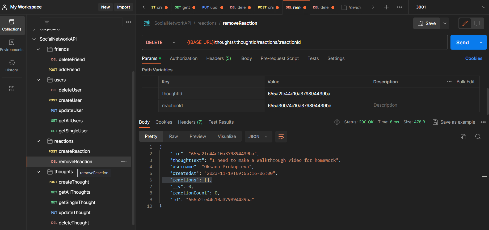

## 🗣️SocialNetworkAPI

## Description
📌API for a social network web application where users can share their thoughts, react to friends thoughts, and create a friend list.

## Installation
🖇️Installation is no needed. But for you to see same code in action on your local computer, you need open your MongoDB Compass, in VS Code termital type nodemon (to run PORT), in Postman create same CRUD requests and you good to go.

## Usage
⌨️used Express.js for routing, a MongoDB database, and the Mongoose ODM. In addition to use the Express.js and Mongoose packages, involved Day.js to format timestamps. In Postman tested users and thoughts for GET all, GET by ID, POST, PUT, DELETE, friends and reactions for POST, DELETE.

## License
Please refer to the LICENSE in the repo.

## Contributing
🤝Contributors welcome for code improvement.

## SocialNetworkAPI in Postman View

## Questions
If you have any questions find me on [GitHub](https://github.com/oprokopieva382) or feel free email me oprokopieva382@gmail.com

## Links
Check out the walkthrough video [click here](https://drive.google.com/file/d/1H1lnx-mghxl40kM4t6JQ0154UC3uh-LI/view)